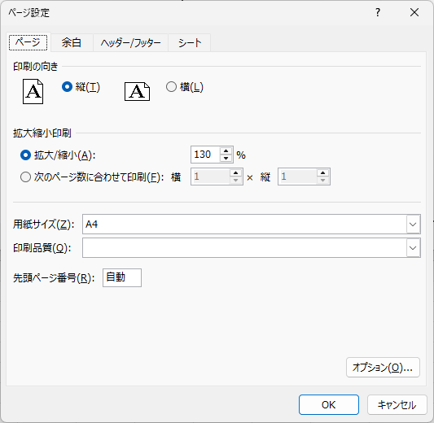
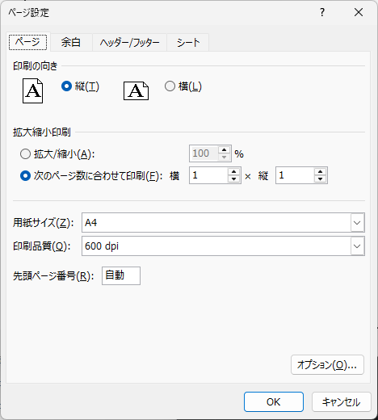

# Special rendering directives

These directives influence how cells are **drawn** rather than how they are bound to data. Most apply only when the workbook is being converted to PDF (or printed via `Excel.Report.PrintDocument`); they are inert when the workbook is opened in Excel.

A single cell can carry multiple directives by separating them with `|`:

```text
#Empty | #FitColumn   ← also valid
```

Whitespace around the pipe is ignored.

## Page-number directives

These render the current PDF page number into the cell. They are evaluated by the renderer, so the workbook itself never carries the resolved value. Place them in **any column except column A** — column A is reserved for loop directives.

| Directive | Result |
| --- | --- |
| `#Page` | Current page number (1-based). Resolved when the cell is drawn. |
| `#PageCount` | Total number of pages. Resolved as a post-process pass after every page is laid out. |
| `#PageOf("/")` | Renders `current<separator>total`. The separator is the literal between the parentheses (e.g. `"/"`, `" of "`, `"-"`). |

Example:

```text
| Page #Page of #PageCount |
| #PageOf(" / ")           |
```

In a 5-page document, the first page renders as `Page 1 of 5` (or `1 / 5` in the second cell), the second page as `Page 2 of 5`, and so on.

The library inserts a tiny post-processing queue so `#PageCount` and `#PageOf` can be back-filled once total pages are known. There is nothing for you to wire up — it is automatic.

## `#Empty`

```text
| #Empty |
```

Normally only cells containing values (or with a non-default fill, border, etc.) participate in the rendering range calculation. `#Empty` keeps a cell **in the rendering range** without drawing any text:

* The cell still contributes to layout (column widths, row heights, bounds for `#FitColumn`).
* No glyphs are rendered — useful for placeholder cells that you want to influence layout but keep visually empty.

Use this when you want a cell's *presence* (and therefore its borders/fills) to count, but the actual text to remain invisible.

## Print scaling — zoom percentage and fit-to-width

The renderer reproduces Excel's **page-setup scaling** so the PDF comes out the same size you would get from Excel's own print. There are two ways to control it, and they are mutually exclusive.

### Option 1 — Fixed zoom percentage

The renderer reads `PageSetup.Scale` (Excel's *Adjust to: NN %* setting) and scales every cell by that factor. `100` is full size; `80` shrinks to 80 %; `150` enlarges to 150 %. A `Scale` of `0` is treated as `100`.

**In Excel:** Page Layout → Page Setup (the ⤢ dialog launcher) → *Scaling* → **Adjust to: `NN` % normal size**.



**In code (ClosedXML):**

```csharp
using var book = new XLWorkbook("report.xlsx");
book.Worksheet(1).PageSetup.Scale = 80;   // render at 80 %

using var ms = new MemoryStream();
book.SaveAs(ms);
using var pdf = ExcelConverter.ConvertToPdf(ms, 1);
```

### Option 2 — Fit to page width

This scales the whole sheet so the **used column width fills the printable page width** (page width minus the left and right margins). Unlike Excel's "Fit to 1 page wide", there is **no** matching height constraint — only the width is fitted, so tall sheets still flow onto additional pages. You can enable it either from a cell directive or from Excel's UI:

```text
| #FitColumn |  ← cell A1 only
```

**In Excel:** Page Layout → Page Setup → *Scaling* → **Fit to: `1` page(s) wide**. The library reads only the *wide* value (`PageSetup.PagesWide > 0`) and fits to width; the *tall* value is **ignored**, so the height is never constrained — it makes no difference whether the "tall" box is blank or set to `1`.



**In code (ClosedXML):**

```csharp
book.Worksheet(1).PageSetup.PagesWide = 1;   // same effect as #FitColumn
```

Notes:

* `#FitColumn` only takes effect in cell `A1`.
* Fit-to-width **overrides** any manual `Scale` percentage — when it is active the zoom value is ignored and the scale is computed from the page width instead.
* `#FitColumn` (the cell directive) and `PageSetup.PagesWide > 0` (the Excel setting) are equivalent — set either one.

## Vertical / rotated text

The renderer respects `IXLAlignment.TextRotation`:

* `0` — horizontal (default).
* `1`–`90` — text rotates **counter-clockwise** by the specified angle.
* `91`–`180` — text rotates **clockwise** (Excel's "negative rotation" range).
* `255` — Excel's "Vertical Text" stack: characters are placed top-to-bottom, columns advance left-to-right.

These behaviours are reproduced automatically — no directive is required.

## Number-format-driven hiding

Cells whose number format is set to `";;;"` are intentionally hidden in Excel. The renderer matches that behaviour and skips drawing them, which is useful for staging values you want to use in formulas but never display.

## See also

* [getting-started.md](getting-started.md) — page setup, paper size, and margin handling.
* [multi-page.md](multi-page.md) — combining the page-number directives with `#PagedLoopRows`.
